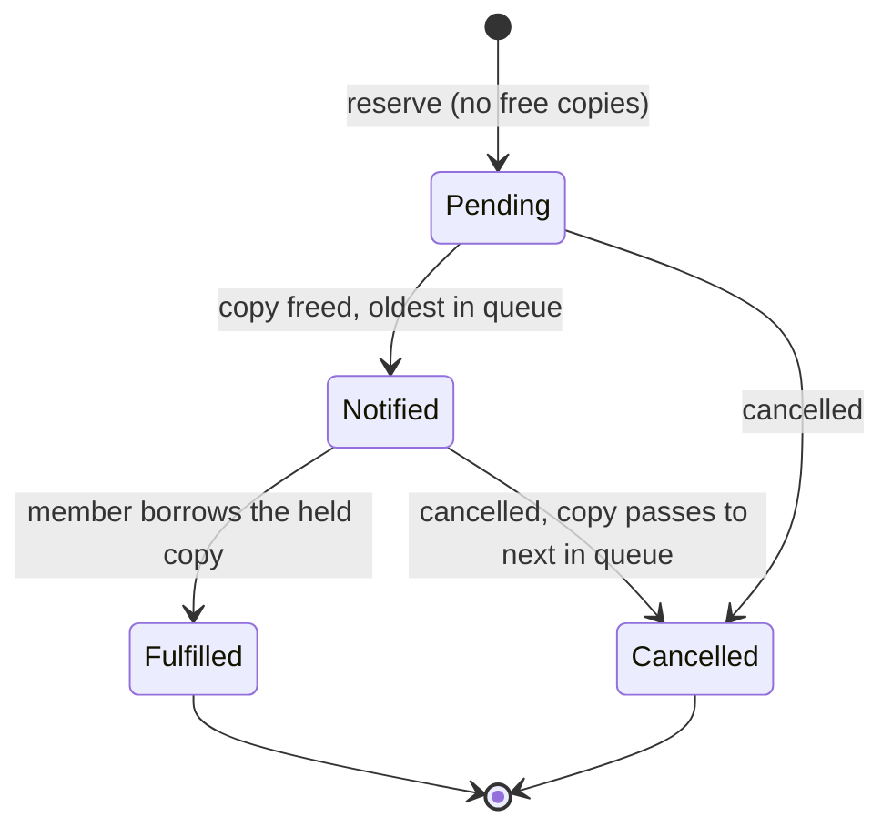
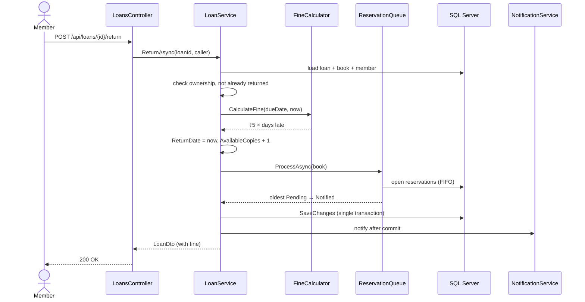
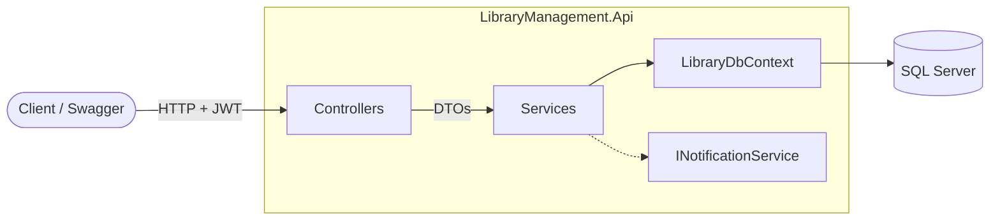
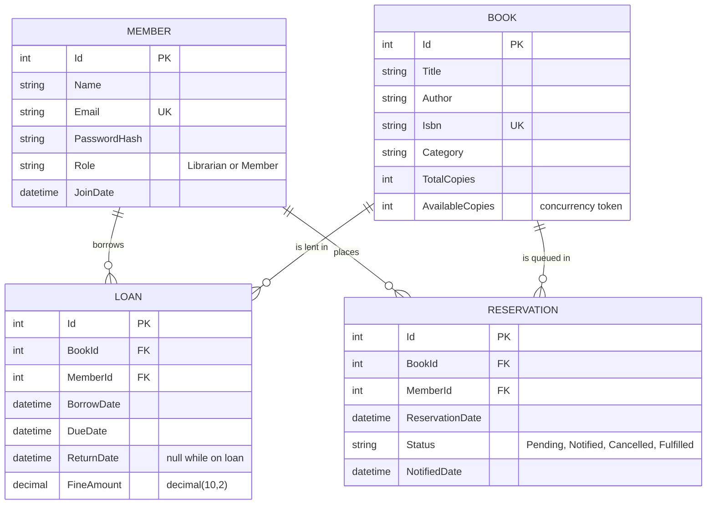

# 📚 Library & Resource Management API

[](https://dotnet.microsoft.com/download/dotnet/8.0)
[](https://learn.microsoft.com/aspnet/core/web-api/)
[](https://learn.microsoft.com/ef/core/)
[](https://www.microsoft.com/sql-server)
[](#testing)
[](LICENSE)

A REST API backend for running a library. It covers:

- the book catalogue
- loans with automatic late fines
- a fair first-come-first-served **reservation queue**
- reports for librarians

It is built with **ASP.NET Core Web API (.NET 8)**, **Entity Framework Core** on **SQL Server** (code-first migrations), and **JWT** authentication with role-based access.

> **Try it in 60 seconds:** clone, `dotnet run`, open Swagger, and log in as `admin@library.local` / `Admin@123`. The database and sample data are created on first start.

---

## Contents

- [✨ Features](#features)
- [🧰 Tech stack](#tech-stack)
- [🚀 Getting started](#getting-started)
- [🔑 Demo accounts & sample data](#demo-accounts--sample-data)
- [📖 API reference](#api-reference)
- [🧪 Walkthrough: the reservation queue in action](#walkthrough-the-reservation-queue-in-action)
- [📐 Business rules](#business-rules)
- [🏗️ Architecture](#architecture)
- [🗄️ Data model](#data-model)
- [⚙️ Configuration](#configuration)
- [🛠️ Database migrations](#database-migrations)
- [✅ Testing](#testing)
- [🩺 Troubleshooting](#troubleshooting)
- [🗺️ Roadmap](#roadmap)
- [📄 License](#license)

---

## Features

| Area | What you get |
|---|---|
| **Authentication** | Register and log in, receive a JWT. Two roles, **Librarian** (admin) and **Member**, enforced on every endpoint |
| **Books** | Create, update and delete (librarians only). Case-insensitive partial search by title, author or category, with paging. ISBN-10/13 validation and duplicate detection |
| **Loans** | Borrow for 14 days. On return, a **₹5/day** late fine is calculated automatically. Members can list their active loans |
| **Reservations** | Reserve a book that's fully lent out and join a **first-come-first-served queue**. A returned copy is **held** for the next person, who gets a notification |
| **Reports** | Top 5 most-borrowed books (hand-written SQL with `GROUP BY` / `ORDER BY`), and overdue loans with the fines owed so far |
| **Quality** | Validated request DTOs, consistent RFC 7807 error responses, concurrency-safe lending, Swagger docs, 24 unit tests |

## Tech stack

| Layer | Technology |
|---|---|
| Framework | ASP.NET Core Web API on .NET 8 (C# 12) |
| Data access | Entity Framework Core 8: code-first, Fluent API, migrations |
| Database | SQL Server (LocalDB, Express, Developer or Docker) |
| Auth | JWT bearer tokens (HMAC-SHA256), ASP.NET Core Identity password hasher (PBKDF2) |
| Validation | DataAnnotations on request DTOs |
| Docs | Swagger / OpenAPI (Swashbuckle) with a built-in *Authorize* button, plus a runnable `.http` demo file |
| Testing | xUnit + in-memory SQLite |

---

## Getting started

### Prerequisites

- [.NET 8 SDK](https://dotnet.microsoft.com/download/dotnet/8.0): `winget install Microsoft.DotNet.SDK.8`
- SQL Server, any of:
  - **LocalDB.** Ships with Visual Studio. It's the default, so no configuration is needed.
  - **SQL Server Express.** `winget install Microsoft.SQLServer.2025.Express`. Then [point the app at it](#use-sql-server-express-or-docker-instead-of-localdb).
  - **Docker.** `docker run -e ACCEPT_EULA=Y -e MSSQL_SA_PASSWORD='Your_str0ng_pw' -p 1433:1433 -d mcr.microsoft.com/mssql/server:2022-latest`

### Run it

```bash
git clone https://github.com/Rishabh893-ux/Library-Management-system.git
cd Library-Management-system
dotnet run --project src/LibraryManagement.Api --launch-profile https
```

Then open **https://localhost:7180/swagger**, or use the ready-made requests in `LibraryManagement.http`:

| Tool | Where | Best for |
|---|---|---|
| **Swagger UI** | https://localhost:7180/swagger (served in `Development` only) | Browsing every endpoint and trying it from the browser |
| **`LibraryManagement.http`** | Repo root. Open it in VS Code (with the [REST Client](https://marketplace.visualstudio.com/items?itemName=humao.rest-client) extension) or in Visual Studio | The whole demo as one-click requests. Logins are chained, so you never copy and paste a token |

On first start in the `Development` environment, the app:

1. creates the database and applies the EF Core migrations, then
2. seeds [sample data](#demo-accounts--sample-data).

### Log in from Swagger

1. Expand **`POST /api/auth/login`**, click *Try it out*, and send:
   ```json
   { "email": "admin@library.local", "password": "Admin@123" }
   ```
2. Copy the `token` from the response.
3. Click **Authorize** (top right), paste the token, and click *Authorize*. Every request you send now carries it.

### Use SQL Server Express or Docker instead of LocalDB

Store your connection string with **user-secrets**, so it stays on your machine and out of Git:

```bash
cd src/LibraryManagement.Api
dotnet user-secrets set "ConnectionStrings:LibraryDb" "Server=.\SQLEXPRESS;Database=LibraryDb;Trusted_Connection=True;TrustServerCertificate=True"
```

<details>
<summary>More connection string examples</summary>

```jsonc
// LocalDB (default, in appsettings.json)
"Server=(localdb)\\MSSQLLocalDB;Database=LibraryDb;Trusted_Connection=True;TrustServerCertificate=True;MultipleActiveResultSets=true"

// SQL Server Express (Windows authentication)
"Server=.\\SQLEXPRESS;Database=LibraryDb;Trusted_Connection=True;TrustServerCertificate=True"

// SQL Server in Docker (SQL authentication)
"Server=localhost,1433;Database=LibraryDb;User Id=sa;Password=<your-password>;TrustServerCertificate=True"
```

</details>

---

## Demo accounts & sample data

When `Database:SeedSampleData` is `true` (the default in Development), an **empty** database is filled with sample data. If any member already exists, seeding is skipped.

| Account | Email | Password | Role |
|---|---|---|---|
| Head Librarian | `admin@library.local` | `Admin@123` | **Librarian** |
| Alice Sharma | `alice@example.com` | `Member@123` | Member |
| Bob Verma | `bob@example.com` | `Member@123` | Member |
| Carol Iyer | `carol@example.com` | `Member@123` | Member |

The seed data is chosen so that every feature has something to show:

| Seeded scenario | Try it with |
|---|---|
| 10 books across Software, Fiction, History, Science, Biography and Self-Help | `GET /api/books?category=fiction` |
| 17 past loans, giving a clear popularity ranking | `GET /api/reports/most-borrowed` |
| 2 overdue loans, 6 and 16 days late (₹110 owed in total)* | `GET /api/reports/overdue-loans` |
| *The God of Small Things* (book 5) lent out, with Carol then Alice queued | [Walkthrough](#walkthrough-the-reservation-queue-in-action) |
| *Midnight's Children* (book 6) lent out, with Bob queued | `GET /api/reservations/book/6` |

\* Loan dates are set relative to when the database is seeded. The overdue numbers above are true on the day of seeding and grow by ₹5 per loan for each day after. The same applies to the ₹80 fine in the walkthrough.

> To start over, drop the database and restart the app: `dotnet ef database drop -f --project src/LibraryManagement.Api`

> ⚠️ The seeded passwords and the development JWT key are for local demos only. Never use them in production.

---

## API reference

All routes are under `/api`. Every route except register and login needs an `Authorization: Bearer <token>` header. Full request and response schemas are in Swagger.

### Auth

| Method | Route | Access | Description |
|---|---|---|---|
| `POST` | `/auth/register` | Anyone | Create a **Member** account. Returns a JWT |
| `POST` | `/auth/login` | Anyone | Exchange an email and password for a JWT (valid for 60 min) |

### Books

| Method | Route | Access | Description |
|---|---|---|---|
| `GET` | `/books?title=&author=&category=&page=1&pageSize=20` | Any user | Search (partial, case-insensitive). Paged |
| `GET` | `/books/{id}` | Any user | Book details, including available copies |
| `POST` | `/books` | Librarian | Add a book. `AvailableCopies` starts equal to `TotalCopies` |
| `PUT` | `/books/{id}` | Librarian | Update a book. Changing `TotalCopies` shifts `AvailableCopies` by the same amount |
| `DELETE` | `/books/{id}` | Librarian | Delete a book. Refused while any copy is on loan |

### Loans

| Method | Route | Access | Description |
|---|---|---|---|
| `POST` | `/loans` | Any user | Borrow `{ "bookId": 1 }`. Librarians can add `"memberId"` to lend for someone else |
| `POST` | `/loans/{id}/return` | Borrower or Librarian | Return a book. Calculates any fine and hands the copy to the reservation queue |
| `GET` | `/loans/active?memberId=` | Self or Librarian | A member's unreturned loans, with an `isOverdue` flag |

### Reservations

| Method | Route | Access | Description |
|---|---|---|---|
| `POST` | `/reservations` | Any user | Reserve `{ "bookId": 5 }`. Only allowed when no copy is free |
| `DELETE` | `/reservations/{id}` | Owner or Librarian | Cancel a reservation. A held copy passes to the next person in the queue |
| `GET` | `/reservations?memberId=` | Self or Librarian | A member's reservations, with queue positions |
| `GET` | `/reservations/book/{bookId}` | Librarian | The full queue for a book |

### Reports (Librarian only)

| Method | Route | Description |
|---|---|---|
| `GET` | `/reports/most-borrowed` | Top 5 books by all-time loan count |
| `GET` | `/reports/overdue-loans` | Unreturned loans past their due date, with days overdue, fine owed and a total |

<details>
<summary><b>Example responses</b> (real output from the seeded database)</summary>

**`POST /api/auth/login`**
```json
{
  "token": "eyJhbGciOiJIUzI1NiIsInR5cCI6IkpXVCJ9...",
  "expiresAtUtc": "2026-09-26T18:52:51Z",
  "member": { "id": 1, "name": "Head Librarian", "email": "admin@library.local", "role": "Librarian", "joinDate": "2025-09-26T17:44:20" }
}
```

**`GET /api/books?category=fiction&pageSize=2`**
```json
{
  "items": [
    { "id": 6, "title": "Midnight's Children", "author": "Salman Rushdie", "isbn": "9780812976533", "category": "Fiction", "totalCopies": 1, "availableCopies": 0 },
    { "id": 10, "title": "The Alchemist", "author": "Paulo Coelho", "isbn": "9780062315007", "category": "Fiction", "totalCopies": 2, "availableCopies": 2 }
  ],
  "page": 1, "pageSize": 2, "totalCount": 3
}
```

**`GET /api/reports/most-borrowed`**
```json
[
  { "bookId": 1,  "title": "Clean Code",                            "author": "Robert C. Martin",  "borrowCount": 6 },
  { "bookId": 9,  "title": "Atomic Habits",                         "author": "James Clear",       "borrowCount": 4 },
  { "bookId": 4,  "title": "Sapiens",                               "author": "Yuval Noah Harari", "borrowCount": 3 },
  { "bookId": 10, "title": "The Alchemist",                         "author": "Paulo Coelho",      "borrowCount": 3 },
  { "bookId": 3,  "title": "Designing Data-Intensive Applications", "author": "Martin Kleppmann",  "borrowCount": 2 }
]
```

**`GET /api/reports/overdue-loans`**
```json
{
  "count": 2,
  "totalFinesOwed": 110,
  "loans": [
    { "loanId": 19, "bookTitle": "The God of Small Things", "memberName": "Bob Verma",    "dueDate": "2026-09-10T17:44:20", "daysOverdue": 16, "fineOwed": 80 },
    { "loanId": 18, "bookTitle": "Clean Code",              "memberName": "Alice Sharma", "dueDate": "2026-09-20T17:44:20", "daysOverdue": 6,  "fineOwed": 30 }
  ]
}
```
*(Some fields are trimmed for readability.)*

</details>

### Errors

Every error uses the same [RFC 7807 ProblemDetails](https://www.rfc-editor.org/rfc/rfc7807) shape, so clients handle all failures the same way:

```json
{
  "type": "https://tools.ietf.org/html/rfc9110#section-15.5.10",
  "title": "Business rule violation",
  "status": 409,
  "detail": "No copies of 'The God of Small Things' are available. Reserve it instead (POST /api/reservations)."
}
```

| Status | When |
|---|---|
| `400` | Validation failed. `errors` lists the messages for each field |
| `401` | Missing or expired token, or wrong email or password |
| `403` | Wrong role, or acting on another member's loans or reservations |
| `404` | The book, loan, reservation or member doesn't exist |
| `409` | A business rule was broken (no copies left, already returned, duplicate ISBN…), or two requests raced for the same copy |

---

## Walkthrough: the reservation queue in action

This walkthrough uses the seeded data. *The God of Small Things* (book 5) has **one** copy. Bob has it and it's **16 days overdue**. Carol reserved it first and Alice second.

```bash
API=https://localhost:7180/api
login() { curl -sk -H 'Content-Type: application/json' -d "{\"email\":\"$1\",\"password\":\"$2\"}" $API/auth/login | sed -E 's/.*"token":"([^"]+)".*/\1/'; }
ADMIN=$(login admin@library.local Admin@123); BOB=$(login bob@example.com Member@123)
CAROL=$(login carol@example.com Member@123); ALICE=$(login alice@example.com Member@123)
```

**1. Carol tries to borrow it and is told to reserve instead** (she already has a reservation)

```bash
curl -sk -H "Authorization: Bearer $CAROL" -H 'Content-Type: application/json' -d '{"bookId":5}' $API/loans
# 409 "No copies of 'The God of Small Things' are available. Reserve it instead"
```

**2. Check the queue:** Carol is #1 and Alice is #2

```bash
curl -sk -H "Authorization: Bearer $ADMIN" $API/reservations/book/5
# Carol Iyer: Pending, queuePosition 1 · Alice Sharma: Pending, queuePosition 2
```

**3. Bob returns it late.** He is fined ₹80, and Carol is notified automatically.

```bash
LOAN=$(curl -sk -H "Authorization: Bearer $BOB" $API/loans/active | sed -E 's/.*"id":([0-9]+),"bookId":5.*/\1/')
curl -sk -X POST -H "Authorization: Bearer $BOB" $API/loans/$LOAN/return
# "fineAmount": 80  → the app log shows: NOTIFY carol@example.com: a copy of 'The God of Small Things' is ready for pickup
```

**4. The copy is held for Carol, so Alice can't take it**

```bash
curl -sk -H "Authorization: Bearer $ALICE" -H 'Content-Type: application/json' -d '{"bookId":5}' $API/loans
# 409 (the only copy is held for Carol)
```

**5. Carol borrows it.** Her reservation becomes `Fulfilled` and Alice moves up to #1.

```bash
curl -sk -H "Authorization: Bearer $CAROL" -H 'Content-Type: application/json' -d '{"bookId":5}' $API/loans
# 201 Created, dueDate = today + 14 days
```

---

## Business rules

| Rule | Implemented in |
|---|---|
| A book with no free copies can't be borrowed; the API answers `409` and suggests reserving | `LoanService.BorrowAsync` |
| The loan period is **14 days**. The fine is **₹5 per calendar day** after the due date, and returning on the due date is free | `FineCalculator` |
| Returning records `ReturnDate` and `FineAmount`, and puts the copy back (`AvailableCopies + 1`) | `LoanService.ReturnAsync` |
| Returning processes the book's reservation queue, **FIFO** by reservation time | `ReservationQueue.ProcessAsync` |
| A book can only be reserved when every copy is taken. A member gets one open reservation per book, and can't reserve a book they already have | `ReservationService.ReserveAsync` |
| A member can't borrow two copies of the same book at once | `LoanService.BorrowAsync` |
| Loan period and fine rate are configurable (`LoanPolicy` settings) | `LoanPolicyOptions` |

### Reservation lifecycle

Notifying the next person isn't enough on its own. If the returned copy just went back on the shelf, anyone could grab it before the notified member arrived. So a notified reservation **holds** the copy:



- Copies that anyone can borrow = `AvailableCopies − (Notified reservations for the book)`.
- `Fulfilled` is a fourth status added to the spec's Pending, Notified and Cancelled, so completed reservations stay in the history.
- **Concurrency:** `Book.AvailableCopies` is an EF Core concurrency token. If two people race for the last copy, one wins and the other gets `409`. A copy can never be lent twice.

### What happens on a return



---

## Architecture



```
LibraryManagement/
├── src/LibraryManagement.Api/
│   ├── Controllers/   Thin HTTP layer: routing, [Authorize], resolving "who is acting"
│   ├── DTOs/          Request models (validated) and response records, the API's public contract
│   ├── Services/      All business logic: Auth, Token, Book, Loan, Reservation,
│   │                  ReservationQueue, FineCalculator, Report, Notification, Mapping
│   ├── Entities/      EF Core entities: Book, Member, Loan, Reservation (+ enums)
│   ├── Data/          LibraryDbContext (Fluent API), DbSeeder, Migrations/
│   ├── Common/        Typed exceptions → ProblemDetails handler, roles, claims helpers
│   ├── Options/       Strongly typed, startup-validated settings
│   └── Program.cs     Composition root: DI, JWT, Swagger, pipeline, migrate + seed
└── tests/LibraryManagement.Tests/     xUnit tests on in-memory SQLite
```

**Design decisions:**

- **Controllers → Services → DbContext.** Controllers never touch the database or return entities. Everything crossing the API boundary is a DTO, mapped in `Services/Mapping.cs`.
- **No generic repository layer.** EF Core's `DbContext` already is a unit of work and `DbSet<T>` a repository, so another layer would add indirection without value. Services sit behind interfaces, so they stay swappable and testable.
- **Errors are exceptions, not status-code plumbing.** Services throw `NotFoundException`, `BusinessRuleException` or `ForbiddenException`. A single `GlobalExceptionHandler` maps them to ProblemDetails, so controllers have no `try/catch`.
- **Time is injected** (`TimeProvider`), so tests control the clock exactly for due dates and fines.
- **One place for the queue.** Returns, cancellations and copy-count increases all go through `ReservationQueue`, so the FIFO and hold rules can't drift apart.
- **Notifications happen after commit.** `INotificationService` currently writes to the log. It's the seam for real email or SMS, and a failed send can never roll back a return.
- **Configuration fails fast.** Settings are validated at startup; for example, the app refuses to start with a JWT key shorter than 32 characters.

---

## Data model



- **Integrity in the database, not just in code:**
  - unique `Isbn` and `Email`
  - check constraints `TotalCopies >= 0` and `0 <= AvailableCopies <= TotalCopies`
- **Indexes:** `(BookId, Status, ReservationDate)` serves the FIFO queue lookup; `(MemberId, ReturnDate)` and `(ReturnDate, DueDate)` serve active-loan and overdue queries.
- **Deletes:** deleting a book cascades to its loan history and reservations, and the API refuses while copies are on loan. Deleting a member is restricted.
- **Readable storage:** enums are stored as strings (`"Notified"`, not `1`).
- **Timestamps are UTC.** They are currently serialized without a `Z` suffix, so treat them as UTC.

---

## Configuration

Settings live in `src/LibraryManagement.Api/appsettings.json`. `appsettings.Development.json` overrides them locally, and user-secrets or environment variables override both.

| Key | Purpose | Default |
|---|---|---|
| `ConnectionStrings:LibraryDb` | SQL Server connection string | LocalDB, database `LibraryDb` |
| `Jwt:Key` | HMAC signing key. **Must be at least 32 characters** | empty; a dev key in Development |
| `Jwt:Issuer` / `Jwt:Audience` | Token issuer and audience | `LibraryManagement.Api` / `LibraryManagement.Clients` |
| `Jwt:ExpiryMinutes` | Token lifetime | `60` |
| `LoanPolicy:LoanPeriodDays` | Loan length in days | `14` |
| `LoanPolicy:FinePerDay` | Late fine in ₹ per day | `5` |
| `Database:ApplyMigrationsOnStartup` | Run migrations when the app starts | `false` (`true` in Development) |
| `Database:SeedSampleData` | Seed demo data into an empty database | `false` (`true` in Development) |

**Outside local development, keep secrets out of the JSON files:**

```bash
cd src/LibraryManagement.Api
dotnet user-secrets set "Jwt:Key" "<random string of 32+ characters>"

# or as environment variables (double underscore = section separator)
export Jwt__Key="..."  ConnectionStrings__LibraryDb="..."
```

---

## Database migrations

The `InitialCreate` migration is in `src/LibraryManagement.Api/Data/Migrations`. The `dotnet-ef` tool version is pinned in `.config/dotnet-tools.json`.

```bash
dotnet tool restore                                                   # install the pinned dotnet-ef

dotnet ef database update --project src/LibraryManagement.Api         # create or upgrade the database

dotnet ef migrations add <Name> --project src/LibraryManagement.Api --output-dir Data/Migrations   # after model changes

dotnet ef migrations script --idempotent --project src/LibraryManagement.Api -o library.sql         # SQL script for DBAs or CI
```

---

## Testing

```bash
dotnet test                                              # all 24 tests
dotnet test --filter "FullyQualifiedName~Reservation"    # just the queue tests
```

The tests focus on the trickiest logic: fines and the reservation queue. They run against **in-memory SQLite** instead of EF's InMemory provider, so foreign keys, check constraints and the concurrency token behave as they would in production. Each service call gets a fresh `DbContext`, just like separate HTTP requests, so stale change tracking can't hide bugs.

| Test class | Covers |
|---|---|
| `FineCalculatorTests` (8) | 14-day due date; fines on the due date, just after midnight, less than 24h late but on a new day, 10 and 30 days late; configurable rates |
| `LoanServiceTests` (8) | Borrowing decrements copies and is refused at 0; late and on-time returns; double-return rejected; members can only return their own loans; active-loans list; overdue report |
| `ReservationQueueTests` (8) | FIFO positions; a return notifies only the head of the queue; a held copy can't be taken by others; the notified member's borrow fulfils the reservation; the queue advances; a cancelled hold passes on; added copies serve the queue; guard rules |

The most-borrowed report uses SQL Server syntax (`TOP`), so it's covered by the end-to-end check against SQL Server rather than by the SQLite tests.

---

## Troubleshooting

| Problem | Fix |
|---|---|
| `A network-related or instance-specific error… (LocalDB)` | LocalDB isn't installed. Install SQL Server Express and [set the connection string](#use-sql-server-express-or-docker-instead-of-localdb) |
| `Invalid object name 'Members'` | The database exists but has no tables. Run `dotnet ef database update --project src/LibraryManagement.Api`, or make sure `Database:ApplyMigrationsOnStartup` is `true` |
| App won't start: `Jwt:Key` validation error | Outside Development there's no key. Set a key of 32+ characters with user-secrets or `Jwt__Key` |
| Browser warns about the HTTPS certificate | Trust the dev certificate once: `dotnet dev-certs https --trust`. Or use the `http` profile at http://localhost:5180/swagger |
| `winget install Microsoft.SQLServer.2022.Express` fails with 404 | That winget package's download link is broken. Use `Microsoft.SQLServer.2025.Express` instead |
| Every request returns `401` | Paste only the token into Swagger's *Authorize* box, without the word `Bearer`. Tokens expire after 60 minutes, so log in again |
| Sample data looks changed after testing | Reset it: `dotnet ef database drop -f --project src/LibraryManagement.Api`, then run the app again |

---

## Roadmap

- [ ] Pickup window for held copies: a background job cancels `Notified` reservations after N days
- [ ] Serialize timestamps with an explicit UTC `Z` suffix
- [ ] Integration tests for HTTP and auth with `WebApplicationFactory`
- [ ] GitHub Actions CI running `dotnet test` on every push
- [ ] Docker Compose (API + SQL Server) for one-command setup
- [ ] Real email notifications behind `INotificationService`
- [ ] Refresh tokens and a librarian-only endpoint to promote members

---

## License

Released under the [MIT License](LICENSE). © 2026 Rishabh Kasaudhan
